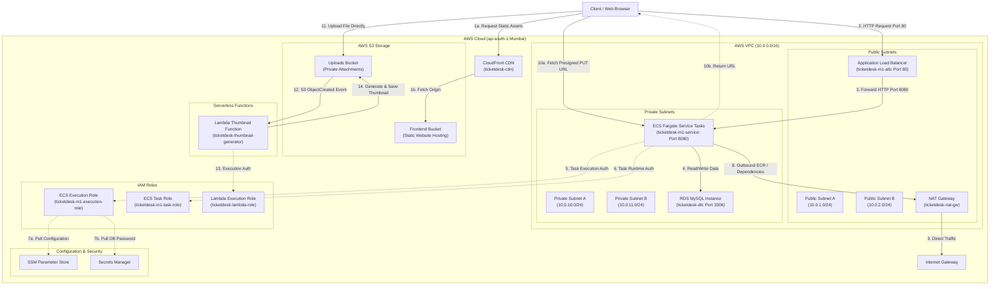

# AWS Services & Architecture Flow

This document details the system architecture, component duties, security boundaries, and runtime execution flows for the TicketDesk deployment on AWS.

---

## 🗺️ Architectural Diagram

The diagram below represents how network zones, databases, containers, static assets, and serverless tasks interact:



---

## 🛠️ AWS Services: Duties and Rationale

| Service | Component Role | Why it is configured this way |
| :--- | :--- | :--- |
| **Amazon VPC** | Network Isolation | Creates a private virtual network (`10.0.0.0/16`). Subnets are divided into **Public** (`10.0.1.0/24`, `10.0.2.0/24`) and **Private** (`10.0.10.0/24`, `10.0.11.0/24`) to isolate container task engines and relational database instances from direct internet scanning. |
| **Amazon CloudFront** | CDN Cache | Distributes frontend assets globally. Caches responses from the S3 frontend bucket, minimizing latency and server load. |
| **Amazon S3** (Frontend) | Static Web Hosting | S3 acts as the origin for the CloudFront CDN, serving static UI files (`index.html`, bundles) reliably and cheaply. |
| **Amazon S3** (Uploads) | File Storage | Stores uploaded attachments. Secured with blocked public read policies; client access uses ephemeral **Presigned URLs** generated on-demand. |
| **Application Load Balancer (ALB)** | Entry Routing & HA | Resides in public subnets (`10.0.1.0/24`, `10.0.2.0/24`). Receives incoming REST API calls and proxies them to the backend ECS tasks. |
| **Amazon ECS (Fargate)** | Container Execution | Executes Spring Boot docker containers serverlessly in private subnets. Bounded by specific Task Execution and Task Runtime IAM Roles for security access control. |
| **Amazon RDS (MySQL 8.0)** | Relational Database | Managed MySQL instance. Handles persistence for tickets, comments, and user records. Strictly bound to Private subnets (`10.0.10.0/24`, `10.0.11.0/24`) with strict inbound security group rules. |
| **AWS Lambda** | Asynchronous Processing | Runs a Python handler on an `s3:ObjectCreated` event. Generates a thumbnail image and saves it back to the uploads bucket under `thumbnails/`. Executed under `ticketdesk-lambda-role`. |
| **AWS Systems Manager (SSM) Parameter Store** | Configuration Repository | Stores non-sensitive runtime parameters (JDBC URLs, S3 bucket details) accessed during task execution initialization. |
| **AWS Secrets Manager** | Secret Repository | Safely generates and stores database credentials. Pulled directly by the ECS task execution agent during task bootstrap. |
| **Amazon CloudWatch** | Monitoring & Logging | Aggregates container stdout streams and visualizes key database, container, load balancer performance graphs on a single dashboard, with active threshold alerts. |

---

## 🌊 Execution Flow Details

### 1. Client Web Request Flow
1. **Frontend Fetching:** The user requests the frontend SPA through the Amazon CloudFront CDN distribution URL.
2. **Static Asset Caching:** CloudFront intercepts the request, serving cached static assets (HTML, CSS, JS) from edge locations. If not cached, it fetches the origin files from the `ticketdesk-frontend` S3 bucket.
3. **API Endpoint Invocation:** The client application makes HTTP requests targeting the Application Load Balancer (ALB) endpoint on port `80`.
4. **Load Balancer Proxying:** The ALB forwards these requests to the private ECS Fargate container instances on target port `8080`.
5. **Backend Processing:** The Spring Boot backend processes requests via REST controllers and database repositories.

---

### 2. Startup Config & Secret Mapping Flow
To avoid storing credentials in code or repository configurations:
1. When ECS Fargate initializes a new container task, the task agent requests configurations.
2. Under the ECS execution IAM role credentials, the container engine talks to **AWS Systems Manager (SSM)** and **AWS Secrets Manager**.
3. AWS returns values for:
   * `/ticketdesk/db_url`
   * `/ticketdesk/db_user`
   * S3 bucket configurations
   * Database password
4. The Fargate task maps these values as standard environment variables inside the Spring Boot container (`DB_URL`, `DB_USER`, `DB_PASSWORD`). Spring Boot reads them at boot to construct the database pool.

---

### 3. Attachment Upload & Thumbnail Flow (Serverless Pattern)
Handling file uploads through application servers wastes container memory and bandwidth. Instead, this system uses a secure **S3 Presigned URL Flow**:

```text
  [Client]              [Spring Boot Backend]             [S3 Bucket]          [AWS Lambda]
      │                           │                            │                     │
      │ 1. Request PUT Url        │                            │                     │
      ├──────────────────────────>│                            │                     │
      │                           │ 2. Generate Presigned URL  │                     │
      │                           │    (Expiring in 15 mins)   │                     │
      │ <─────────────────────────┤                            │                     │
      │                           │                            │                     │
      │ 3. Upload File Directly using PUT url                  │                     │
      ├───────────────────────────────────────────────────────>│                     │
      │                                                        │ 4. Trigger Event    │
      │                                                        │    (ObjectCreated)  │
      │                                                        ├────────────────────>│
      │                                                        │                     │ 5. Write mock
      │                                                        │                     │    thumbnail
      │                                                        │<────────────────────┤
```

1. **URL Request:** The user triggers an attachment upload. The frontend sends a GET request to the backend: `/api/attachments/presigned-put?key=my-image.jpg`.
2. **URL Generation:** The backend controller (`AttachmentController.java`) calls the AWS S3 SDK to generate an ephemeral, pre-signed upload URL (expires in 15 minutes) and returns it.
3. **Direct S3 Upload:** The client performs an HTTP `PUT` upload directly to S3 using the generated URL. The file is successfully stored in the uploads bucket.
4. **Trigger Event:** S3 fires an `s3:ObjectCreated` notification immediately to the Lambda service.
5. **Serverless Execution:** The Python Lambda function gets the file metadata, generates a mock thumbnail prefix version, and writes it back to `thumbnails/my-image.jpg`.
6. **Fetch File:** When the user displays the page, the frontend asks the backend for the GET url: `/api/attachments/presigned-thumbnail?key=my-image.jpg` to view the thumbnail securely.

---

## 🌐 Network Layout & Subnet VPC Ranges

The application is deployed within a dedicated Virtual Private Cloud (VPC) with isolated routing tiers:

* **VPC CIDR block:** `10.0.0.0/16`
* **Public Subnet A (`10.0.1.0/24`) & B (`10.0.2.0/24`):**
  * Internet-facing zones.
  * Public Subnet A hosts the primary NAT Gateway (`ticketdesk-nat-gw`) and the public-facing Application Load Balancer (`ticketdesk-m1-alb`).
  * Public Subnet B provides Multi-AZ high availability.
* **Private Subnet A (`10.0.10.0/24`) & B (`10.0.11.0/24`):**
  * Isolated tiers with no direct internet ingress routing.
  * Private Subnet A hosts the ECS Fargate container tasks (`ticketdesk-m1-service`) and the primary Amazon RDS MySQL database instance (`ticketdesk-db`).
  * Private Subnet B provides target nodes for multi-AZ database clustering and container scaling.

---

## 🔑 IAM Roles & Permissions

Each compute and serverless entity is strictly governed by IAM roles adhering to the principle of least privilege:

1. **ECS Task Execution Role (`ticketdesk-m1-execution-role`):**
   * **Purpose:** Used by the AWS ECS container agent to initialize and run the container task.
   * **Key Policies:** 
     * `AmazonECSTaskExecutionRolePolicy` (pull container images from ECR, write system logs to CloudWatch).
     * Custom secrets policy allowing read access to AWS Systems Manager (SSM) Parameter Store (`ssm:GetParameter*`) and AWS Secrets Manager (`secretsmanager:GetSecretValue`).
2. **ECS Task Role (`ticketdesk-m1-task-role`):**
   * **Purpose:** Used by the running Spring Boot application inside the container at runtime.
   * **Key Policies:**
     * Custom S3 permissions allowing read, write, and deletion (`s3:PutObject`, `s3:GetObject`, `s3:DeleteObject`, `s3:ListBucket`) in the `ticketdesk-uploads` S3 bucket.
     * Custom secrets permissions for runtime config reads.
3. **Lambda Execution Role (`ticketdesk-lambda-role`):**
   * **Purpose:** Used by the serverless thumbnail generation Lambda.
   * **Key Policies:**
     * `AWSLambdaBasicExecutionRole` (write runtime logs to CloudWatch).
     * Custom S3 policy allowing GET (`s3:GetObject`) and PUT (`s3:PutObject`) specifically for the `ticketdesk-uploads/*` assets.

---

## 🔒 Security & Isolation Rules

* **Public Subnet Access:** Only the ALB and the NAT Gateway have public IPs. The ALB acts as the sole internet gateway for HTTP requests to the backend.
* **Compute Security Group (`ticketdesk-m1-task-sg`):** The ECS Fargate container does **not** accept traffic directly from the internet. Its Security Group restricts inbound traffic exclusively to the `ticketdesk-m1-alb-sg` Security Group on port `8080`.
* **Database Security Group (`ticketdesk-db-sg`):** The MySQL instance has no public IP and rejects all connections unless they originate from the `ticketdesk-m1-task-sg` Security Group on port `3306`.
* **Private Network egress:** The ECS Tasks use the NAT Gateway in the public subnets (`10.0.1.0/24`) to establish outbound connections to pull images from ECR, fetch configurations from SSM/Secrets Manager, or install packages, ensuring they remain hidden from inbound scanning.
