# 🚀 Nexus Control - Enterprise ITSM Architecture & Deployment Guide

Welcome to **Nexus Control**, a next-generation IT Service Management (ITSM) system. This document provides an exhaustive, linear architectural breakdown, component guides, and console navigation instructions for the AWS deployment.

---

## 🗺️ Linear Architecture Flow

```mermaid
graph TD
    classDef client fill:#2a2a2a,stroke:#b4c5ff,stroke-width:2px,color:#e5e2e1;
    classDef router fill:#201f1f,stroke:#ffb95f,stroke-width:2px,color:#e5e2e1;
    classDef compute fill:#2563eb,stroke:#b4c5ff,stroke-width:2px,color:#ffffff;
    classDef storage fill:#0e0e0e,stroke:#4edea3,stroke-width:2px,color:#e5e2e1;
    classDef iam fill:#3f3f46,stroke:#a1a1aa,stroke-width:1px,color:#ffffff;
    classDef network fill:#18181b,stroke:#a855f7,stroke-width:2px,color:#e5e2e1;
    classDef config fill:#7c2d12,stroke:#f97316,stroke-width:1px,color:#ffffff;

    Client["💻 Client Browser<br>(React Frontend SPA)"]:::client
    CF["🌐 CloudFront CDN<br>(ticketdesk-cdn)"]:::router
    IGW["🛣️ Internet Gateway<br>(ticketdesk-igw)"]:::network

    subgraph VPC ["AWS VPC (10.0.0.0/16)"]
        
        subgraph PublicSubnets ["Public Subnets"]
            PubSubA["Public Subnet A<br>(10.0.1.0/24)"]:::network
            PubSubB["Public Subnet B<br>(10.0.2.0/24)"]:::network
            
            ALB_SG["🔒 ALB Security Group<br>(ticketdesk-m1-alb-sg)"]:::iam
            ALB["⚖️ Application Load Balancer<br>(ticketdesk-m1-alb: Port 80)"]:::router
            NAT["🔌 NAT Gateway<br>(ticketdesk-nat-gw)"]:::network
            TG["🎯 ALB Target Group<br>(ticketdesk-m1-tg: Port 8080)"]:::router
        end
        
        subgraph PrivateSubnets ["Private Subnets"]
            PrivSubA["Private Subnet A<br>(10.0.10.0/24)"]:::network
            PrivSubB["Private Subnet B<br>(10.0.11.0/24)"]:::network
            
            Task_SG["🔒 Task Security Group<br>(ticketdesk-m1-task-sg)"]:::iam
            
            subgraph ECS_Cluster ["ECS Cluster (ticketdesk-m1-cluster)"]
                ECS_Service["📦 ECS Service<br>(ticketdesk-m1-service)"]:::compute
                Task_Def["📋 Task Definition<br>(ticketdesk-m1-backend-task)"]:::compute
                ECS_Task["⚙️ ECS Fargate Task<br>(Spring Boot Container)"]:::compute
            end
            
            DB_SG["🔒 DB Security Group<br>(ticketdesk-db-sg)"]:::iam
            RDS["🗄️ RDS MySQL Instance<br>(ticketdesk-db: Port 3306)"]:::storage
        end
        
    end

    subgraph Storage ["S3 Storage & Processing"]
        S3_Front["🌐 S3 Frontend Bucket<br>(ticketdesk-frontend)"]:::storage
        S3_Uploads["📦 S3 Uploads Bucket<br>(ticketdesk-uploads)"]:::storage
        Lambda["⚡ AWS Lambda<br>(thumbnail-generator)"]:::compute
    end

    subgraph ECR_Reg ["Container Registry"]
        ECR["🐳 ECR Repository<br>(ticketdesk-backend)"]:::storage
    end

    subgraph Config ["Configuration & Security"]
        SSM["⚙️ SSM Parameter Store"]:::config
        Secrets["🔑 Secrets Manager"]:::config
    end

    subgraph IAM_Roles ["IAM Identities"]
        ExecRole["🔑 ECS Execution Role<br>(ticketdesk-m1-execution-role)"]:::iam
        TaskRole["🔑 ECS Task Role<br>(ticketdesk-m1-task-role)"]:::iam
        LambdaRole["🔑 Lambda Execution Role<br>(ticketdesk-lambda-role)"]:::iam
    end

    %% Routing Connections
    Client -->|1a. Request Static HTML/JS/CSS| CF
    CF -->|1b. Serve Static Assets| S3_Front
    Client -->|2. HTTP Request Port 80| IGW
    IGW -->|3. Route to ALB| ALB
    ALB_SG -.->|Guard ingress/egress| ALB
    ALB -->|4. Forward to Target Group| TG
    TG -->|5. Forward Port 8080| ECS_Task
    Task_SG -.->|Guard ingress| ECS_Task
    ECS_Task -->|6. Connect Port 3306| RDS
    DB_SG -.->|Guard port 3306 ingress| RDS

    %% Infrastructure dependencies
    ECS_Task -.->|7. Launch Auth| ExecRole
    ECS_Task -.->|8. Access Auth| TaskRole
    ExecRole -.->|9a. Pull Parameters| SSM
    ExecRole -.->|9b. Pull DB Password| Secrets
    ExecRole -.->|10. Pull Container Image| ECR

    %% Private Task Internet Access
    ECS_Task -->|11. Outbound requests| NAT
    NAT -->|12. Route Outbound| IGW

    %% File upload presigned URL flow
    Client -->|13a. Request upload PUT URL| ECS_Task
    ECS_Task -.->|13b. Return presigned URL| Client
    Client -->|14. Direct upload using PUT URL| S3_Uploads
    S3_Uploads -->|15. S3 ObjectCreated Event| Lambda
    Lambda -.->|16. Lambda runtime Auth| LambdaRole
    Lambda -->|17. Save generated thumbnail| S3_Uploads
```

---

## ⚡ Stage-by-Stage Architecture Breakdown

### 📍 Stage 1: Load Balancing & Traffic Routing
* **Service:** Application Load Balancer (ALB) — `ticketdesk-m1-alb`
* **Why We Chose It:** 
  ALB operates at Layer 7 (Application Layer) of the OSI model. It enables path-based routing rules, letting us direct `/api/*` traffic to the backend ECS containers, and `/` or static files to the embedded frontend server on the same domain, preventing CORS issues.
* **Console Navigation:**
  1. Open the [EC2 Console](https://ap-south-1.console.aws.amazon.com/ec2/v2/home?region=ap-south-1).
  2. In the left navigation pane, under **Load Balancing**, click **Load Balancers**.
  3. Select **ticketdesk-m1-alb** to find the **DNS name** under the **Details** tab.

---

### 📍 Stage 1.5: Content Delivery & Edge Caching
* **Service:** Amazon CloudFront — `ticketdesk-cdn`
* **Why We Chose It:**
  CloudFront is a global Content Delivery Network (CDN) service. By placing CloudFront in front of the S3 static website hosting bucket, UI assets (HTML, CSS, JS) are cached at edge locations globally. This minimizes page load times for end users and drastically reduces S3 read costs and traffic.
* **Console Navigation:**
  1. Open the [CloudFront Console](https://us-east-1.console.aws.amazon.com/cloudfront/v4/home).
  2. Find and select the **ticketdesk-cdn** distribution to view its Domain Name and status.

---

### 📍 Stage 2: Container Orchestration (Compute)
* **Service:** Amazon Elastic Container Service (ECS) with AWS Fargate
* **Why We Chose Fargate over EC2:**
  Fargate is a **serverless** compute engine. We do not have to provision, patch, or scale virtual machines (EC2 instances). AWS manages the underlying infrastructure, allowing us to specify CPU and memory at the task level and pay only for active resources.
* **Why Task Definitions?**
  An **ECS Task Definition** is a text blueprint (in JSON format) describing one or more containers that form your application. It specifies parameters such as:
  * Container Image URL (ECR repository location)
  * CPU & Memory allocations (e.g., 0.5 vCPU, 1GB RAM)
  * Port mappings (e.g., host port 8080 mapped to container port 8080)
  * Environment variables (Database endpoint, S3 bucket names)
  * IAM Task execution roles (permissions to pull images and write logs)
* **Console Navigation:**
  1. Open the [ECS Console](https://ap-south-1.console.aws.amazon.com/ecs/v2/home?region=ap-south-1).
  2. Click **Task definitions** in the left menu to view, version, or update application task blueprints.
  3. Click **Clusters**, choose **ticketdesk-m1-cluster**, and click **Services** to monitor tasks, task deployments, and scaling options.

---

### 📍 Stage 3: Relational Persistence
* **Service:** Amazon RDS (MySQL Engine)
* **Why We Chose It:**
  A managed relational database that automates replication, backups, security patching, and failover. We configure it inside private subnets of our VPC, ensuring zero public internet accessibility.
* **Console Navigation:**
  1. Open the [RDS Console](https://ap-south-1.console.aws.amazon.com/rds/home?region=ap-south-1).
  2. In the left navigation pane, click **Databases**.
  3. Select **ticketdesk-db** to view the DB Endpoint URL and Port under the **Connectivity & security** tab.

---

### 📍 Stage 4: File & Media Storage
* **Service:** Amazon Simple Storage Service (S3) — `ticketdesk-uploads`
* **Why We Chose It:**
  Provides secure, durable object storage. Pre-signed URLs are generated by our Spring Boot container, enabling secure browser-to-bucket uploads directly without choking the backend server's network bandwidth.
* **Console Navigation:**
  1. Open the [S3 Console](https://s3.console.aws.amazon.com/s3/home?region=ap-south-1).
  2. Find and select the **ticketdesk-uploads-xxxxxxxx** bucket.
  3. View **CORS configurations** under the **Permissions** tab.

---

### 📍 Stage 5: Serverless Image Processing
* **Service:** AWS Lambda — `ticketdesk-thumbnail-generator`
* **Why We Chose It:**
  AWS Lambda is an event-driven serverless compute platform. When users upload attachments directly to the S3 uploads bucket, S3 fires an `ObjectCreated` trigger. This invokes the Lambda function asynchronously to process the image and save a mock thumbnail text file back to the bucket (`thumbnails/` prefix) on-demand, running without provisioning servers.
* **Console Navigation:**
  1. Open the [AWS Lambda Console](https://ap-south-1.console.aws.amazon.com/lambda/home?region=ap-south-1).
  2. Select the **ticketdesk-thumbnail-generator** function to inspect the code, triggers, monitor execution counts, or view logs.

---

### 📍 Stage 6: VPC Network Segmentation
* **Service:** AWS VPC — Subnets & Networking
* **Why We Chose It:**
  Our infrastructure is split across multiple Availability Zones (AZs) for high availability and separated into different security domains:
  * **Public Subnets (`10.0.1.0/24`, `10.0.2.0/24`):** Accept inbound external connections (ALB) and outbound gateway routes (NAT Gateway).
  * **Private Subnets (`10.0.10.0/24`, `10.0.11.0/24`):** Strictly isolate the database instance and backend ECS task instances. All egress is proxied through the NAT Gateway.
* **Console Navigation:**
  1. Open the [VPC Console](https://ap-south-1.console.aws.amazon.com/vpc/home?region=ap-south-1).
  2. Navigate to **Subnets** or **Route Tables** to review routing policies.

---

### 📍 Stage 7: Security Governance (IAM Roles)
* **Service:** AWS IAM Roles
* **Why We Chose It:**
  We implement tight, programmatic access controls:
  * **ECS Execution Role (`ticketdesk-m1-execution-role`):** Allows container task bootstrapping (logs write to CloudWatch, config/secret values pull from SSM/Secrets Manager).
  * **ECS Task Role (`ticketdesk-m1-task-role`):** Allows application runtime tasks (direct object writes, reads, and deletes inside the `ticketdesk-uploads` bucket).
  * **Lambda Role (`ticketdesk-lambda-role`):** Permits basic Lambda execution log creation and read/write access to S3.
* **Console Navigation:**
  1. Open the [IAM Console](https://us-east-1.console.aws.amazon.com/iam/home).
  2. Click **Roles** in the left sidebar and search for `ticketdesk-` prefix to view trust relationships and policies.

---

## 🔗 Active Deployed Endpoints

| Environment Component | Endpoint URL | Description |
| :--- | :--- | :--- |
| **Unified ALB URL (App & API)** | `http://ticketdesk-m1-alb-756973487.ap-south-1.elb.amazonaws.com` | Primary user-facing client application & routing gateway |
| **Backend API Health Check** | `http://ticketdesk-m1-alb-756973487.ap-south-1.elb.amazonaws.com/health` | Returns `{"status":"UP"}` for service health triages |
| **Static Website Mirror** | `http://ticketdesk-frontend-0ee57288.s3-website.ap-south-1.amazonaws.com` | Alternative public S3 website endpoint hosting static frontend assets |
| **CloudFront CDN Distribution** | `http://ticketdesk-cdn.cloudfront.net` (Conceptual) | Global edge caching layer serving static UI assets securely |

---

## 🛠️ Security & Operational Best Practices

> [!IMPORTANT]
> **Database Isolation:** The RDS Instance and ECS Fargate Tasks are deployed strictly in the **Private subnet range** (`10.0.10.0/24` and `10.0.11.0/24`). Public routing is blocked.
> Only the ECS Fargate Tasks (running in private subnets) can connect to the database via RDS security group policies.

> [!TIP]
> **S3 Bucket CORS Rules:** To support client browser attachments and avoid the `Failed to fetch` error, the S3 uploads bucket is configured with:
> - Allowed Headers: `["*"]`
> - Allowed Methods: `["PUT", "GET", "POST", "HEAD"]`
> - Allowed Origins: `["*"]`

---

## ⚙️ How to Monitor and Debug Services

### 1. View Logs in CloudWatch
1. Open the [CloudWatch Console](https://ap-south-1.console.aws.amazon.com/cloudwatch/home?region=ap-south-1).
2. Under **Logs** in the left menu, select **Log Groups**.
3. Select the log group named `/ecs/ticketdesk-m1-backend` to view live application streams from Spring Boot containers.

### 2. Inspect Target Group Health
1. Open the [EC2 Console](https://ap-south-1.console.aws.amazon.com/ec2/v2/home?region=ap-south-1).
2. Scroll to **Load Balancing** and select **Target Groups**.
3. Select **ticketdesk-m1-tg** and click the **Targets** tab to see active target container status (`healthy` / `draining` / `unhealthy`).
