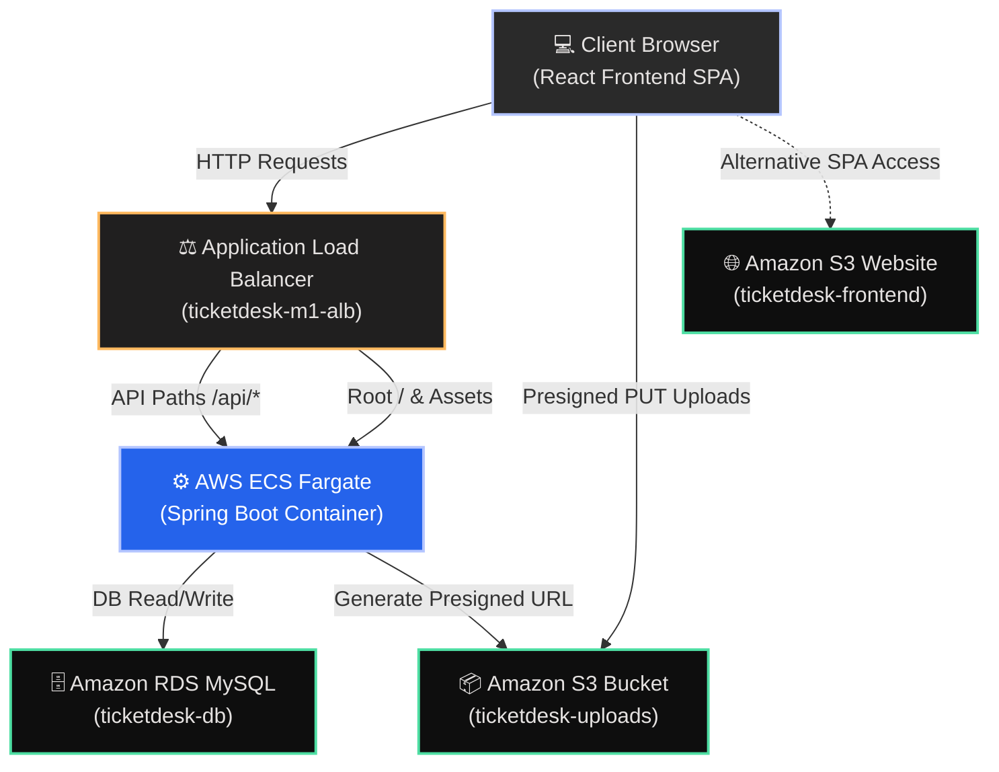

# 🚀 Nexus Control - Enterprise ITSM Architecture & Deployment Guide

Welcome to **Nexus Control**, a next-generation IT Service Management (ITSM) system. This document provides an exhaustive, linear architectural breakdown, component guides, and console navigation instructions for the AWS deployment.

---

## 🗺️ Linear Architecture Flow

---

## ⚡ Stage-by-Stage Architecture Breakdown

### 📍 Stage 1: Load Balancing & Traffic Routing
* **Service:** Application Load Balancer (ALB) — `ticketdesk-m1-alb`
* **Why We Chose It:** 
  ALB operates at Layer 7 (Application Layer) of the OSI model. It enables path-based routing rules, letting us direct `/api/*` traffic to the backend ECS containers, and `/` or static files to the embedded frontend server on the same domain, preventing CORS issues.
* **Console Navigation:**
  1. Open the [EC2 Console](https://ap-south-1.console.aws.amazon.com/ec2/v2/home?region=ap-south-1).
  2. In the left navigation pane, under **Load Balancing**, click **Load Balancers**.
  3. Select **ticketdesk-m1-alb** to find the **DNS name** under the **Details** tab.

---

### 📍 Stage 2: Container Orchestration (Compute)
* **Service:** Amazon Elastic Container Service (ECS) with AWS Fargate
* **Why We Chose Fargate over EC2:**
  Fargate is a **serverless** compute engine. We do not have to provision, patch, or scale virtual machines (EC2 instances). AWS manages the underlying infrastructure, allowing us to specify CPU and memory at the task level and pay only for active resources.
* **Why Task Definitions?**
  An **ECS Task Definition** is a text blueprint (in JSON format) describing one or more containers that form your application. It specifies parameters such as:
  * Container Image URL (ECR repository location)
  * CPU & Memory allocations (e.g., 0.5 vCPU, 1GB RAM)
  * Port mappings (e.g., host port 8080 mapped to container port 8080)
  * Environment variables (Database endpoint, S3 bucket names)
  * IAM Task execution roles (permissions to pull images and write logs)
* **Console Navigation:**
  1. Open the [ECS Console](https://ap-south-1.console.aws.amazon.com/ecs/v2/home?region=ap-south-1).
  2. Click **Task definitions** in the left menu to view, version, or update application task blueprints.
  3. Click **Clusters**, choose **ticketdesk-m1-cluster**, and click **Services** to monitor tasks, task deployments, and scaling options.

---

### 📍 Stage 3: Relational Persistence
* **Service:** Amazon RDS (MySQL Engine)
* **Why We Chose It:**
  A managed relational database that automates replication, backups, security patching, and failover. We configure it inside private subnets of our VPC, ensuring zero public internet accessibility.
* **Console Navigation:**
  1. Open the [RDS Console](https://ap-south-1.console.aws.amazon.com/rds/home?region=ap-south-1).
  2. In the left navigation pane, click **Databases**.
  3. Select **ticketdesk-db** to view the DB Endpoint URL and Port under the **Connectivity & security** tab.

---

### 📍 Stage 4: File & Media Storage
* **Service:** Amazon Simple Storage Service (S3) — `ticketdesk-uploads`
* **Why We Chose It:**
  Provides secure, durable object storage. Pre-signed URLs are generated by our Spring Boot container, enabling secure browser-to-bucket uploads directly without choking the backend server's network bandwidth.
* **Console Navigation:**
  1. Open the [S3 Console](https://s3.console.aws.amazon.com/s3/home?region=ap-south-1).
  2. Find and select the **ticketdesk-uploads-xxxxxxxx** bucket.
  3. View **CORS configurations** under the **Permissions** tab.

---

## 🔗 Active Deployed Endpoints

| Environment Component | Endpoint URL | Description |
| :--- | :--- | :--- |
| **Unified ALB URL (App & API)** | `http://ticketdesk-m1-alb-756973487.ap-south-1.elb.amazonaws.com` | Primary user-facing client application & routing gateway |
| **Backend API Health Check** | `http://ticketdesk-m1-alb-756973487.ap-south-1.elb.amazonaws.com/health` | Returns `{"status":"UP"}` for service health triages |
| **Static Website Mirror** | `http://ticketdesk-frontend-0ee57288.s3-website.ap-south-1.amazonaws.com` | Alternative public bucket serving static frontend assets |

---

## 🛠️ Security & Operational Best Practices

> [!IMPORTANT]
> **Database Isolation:** The RDS Instance has been deployed strictly in the **Private subnet range** (`10.0.11.0/24` and `10.0.12.0/24`). Public routing is blocked.
> Only the ECS Fargate Tasks (running in private subnets) can connect to the database via RDS security group policies.

> [!TIP]
> **S3 Bucket CORS Rules:** To support client browser attachments and avoid the `Failed to fetch` error, the S3 uploads bucket is configured with:
> - Allowed Headers: `["*"]`
> - Allowed Methods: `["PUT", "GET", "POST", "HEAD"]`
> - Allowed Origins: `["*"]`

---

## ⚙️ How to Monitor and Debug Services

### 1. View Logs in CloudWatch
1. Open the [CloudWatch Console](https://ap-south-1.console.aws.amazon.com/cloudwatch/home?region=ap-south-1).
2. Under **Logs** in the left menu, select **Log Groups**.
3. Select the log group named `/ecs/ticketdesk-m1-backend` to view live application streams from Spring Boot containers.

### 2. Inspect Target Group Health
1. Open the [EC2 Console](https://ap-south-1.console.aws.amazon.com/ec2/v2/home?region=ap-south-1).
2. Scroll to **Load Balancing** and select **Target Groups**.
3. Select **ticketdesk-m1-tg** and click the **Targets** tab to see active target container status (`healthy` / `draining` / `unhealthy`).
