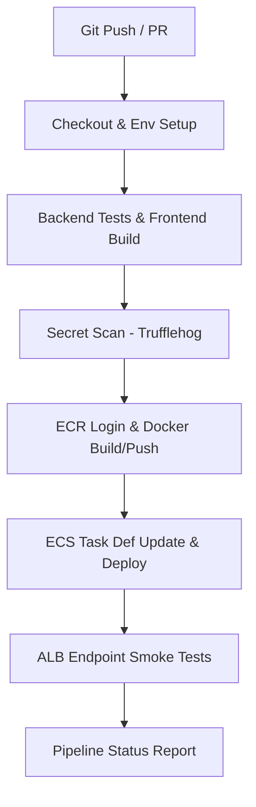

# Nexus Control - Enterprise ITSM POC Project Document

This document serves as the official Proof of Concept (POC) evaluation record for **Nexus Control** (Incident & IT Service Management Platform). It details the system architecture, configurations, and contribution mappings.

---

## A. POC / Project Document

### 1. Project Overview
**Nexus Control** is a cloud-native IT Service Management (ITSM) platform designed to automate incident tracking, SLA reporting, and IT team workflows.

- **Git Repository URL**: `https://github.com/Jallepalli-Sai-Nikhil/ticketdesk.git`
- **Application Load Balancer (ALB) URL**: `http://ticketdesk-m1-alb-756973487.ap-south-1.elb.amazonaws.com`
- **Backend API Health Check Endpoint**: `http://ticketdesk-m1-alb-756973487.ap-south-1.elb.amazonaws.com/health`
- **Static Website Hosting S3 Mirror**: `http://ticketdesk-frontend-0ee57288.s3-website.ap-south-1.amazonaws.com`

---

### 2. Architecture Diagram

```text
+-------------------------------------------------------------------------------------------------------------------------+
|                                                      Client Browser                                                     |
+-------------------------------------------------------------------------------------------------------------------------+
                                      |                                                ^
                                      | HTTP/HTTPS requests                            | Static assets / API response
                                      v                                                |
+-------------------------------------------------------------------------------------------------------------------------+
|                                              Amazon CloudFront (CDN)                                                    |
|  - Default Behavior (/*) -> S3 Website Origin (Static Assets)                                                           |
|  - API Behavior (/api/*) -> ALB Origin (Dynamic API Calls)                                                              |
+-------------------------------------------------------------------------------------------------------------------------+
                    |                                                      |
                    | (Cache Miss / Fetch Web Assets)                      | (Forward API Request)
                    v                                                      v
+--------------------------------------+             +--------------------------------------------------------------------+
|          Amazon S3 Website           |             |                       Internet Gateway (IGW)                       |
|        (ticketdesk-frontend)         |             +--------------------------------------------------------------------+
+--------------------------------------+                                                   |
                                                                                           |
                                                                                           v
+=========================================================================================================================+
|                                                    AWS VPC (10.0.0.0/16)                                                |
|                                                                                                                         |
|  +-------------------------------------------------------------------------------------------------------------------+  |
|  |                                  PUBLIC SUBNETS (10.0.1.0/24 & 10.0.2.0/24)                                       |  |
|  |                                                                                                                   |  |
|  |   +-----------------------------------------------------------------------------------------------------------+   |  |
|  |   |                                  Application Load Balancer (ALB) (Port 80)                                |   |  |
|  |   +-----------------------------------------------------------------------------------------------------------+   |  |
|  |                                                        |                                                          |  |
|  |                                                        | Outbound NAT traffic                                     |  |
|  |   +-------------------+                                v                                                          |  |
|  |   |    NAT Gateway    |<---------------------------------------------------------+                                |  |
|  |   +-------------------+                                                          |                                |  |
|  |             |                                                                    |                                |  |
|  |             v (Elastic IP)                                                       |                                |  |
|  |       To AWS Services (ECR, SSM, etc.)                                           |                                |  |
|  +--------------------------------------------------------|-------------------------|--------------------------------+  |
|                                                           |                         |                                   |
|                                                           | Route to Fargate Tasks  |                                   |
|                                                           v                         |                                   |
|  +----------------------------------------------------------------------------------|--------------------------------+  |
|  |                                  PRIVATE SUBNETS (10.0.10.0/24 & 10.0.11.0/24)   |                                |  |
|  |                                                                                  |                                |  |
|  |   +------------------------------------------------------------------------------|----------------------------+   |  |
|  |   |                                         AWS ECS Fargate Cluster              |                            |   |  |
|  |   |                                                                              |                            |   |  |
|  |   |   +--------------------------------------------------------------------------v------------------------+   |   |  |
|  |   |   |                                Spring Boot Backend Tasks (Port 8080)                                  |   |   |  |
|  |   |   +---------------------------------------------------------------------------------------------------+   |   |  |
|  |   |                                    |                            |                       ^                 |   |  |
|  |   |                                    | 4. DB Operations           | 8. S3 Presigned URL   | 6. Pull Config  |   |  |
|  |   +------------------------------------|----------------------------|-----------------------|-----------------+   |  |
|  |                                        |                            |                       |                     |  |
|  |   +------------------------------------v----+                       |                       |                     |  |
|  |   |           RDS MySQL Database            |                       |                       |                     |  |
|  |   |             (ticketdesk-db)             |                       |                       |                     |  |
|  |   +-----------------------------------------+                       |                       |                     |  |
|  +---------------------------------------------------------------------|-----------------------|---------------------+  |
+========================================================================|=======================|========================+
                                                                         |                       |
                                                                         |                       | 7. SSM & Secrets Manager
                                                                         v                       | (Dynamic configs & credentials)
                                                                 +---------------+               |
                                                                 |  S3 Uploads   |---------------+
                                                                 |    Bucket     |
                                                                 +---------------+
                                                                         |
                                                                         | 10. ObjectCreated Trigger
                                                                         v
                                                                 +---------------+
                                                                 |  AWS Lambda   |
                                                                 |  (Thumbnail   |
                                                                 |  Generator)   |
                                                                 +---------------+
```

---

### 3. AWS Services Used

| AWS Service | Role | Rationale & Configuration Details |
| :--- | :--- | :--- |
| **Amazon VPC** | Network Isolation | Formulates a private software-defined network (`10.0.0.0/16`) to isolate databases, application services, and serverless compute from public entry. |
| **Subnets (Public & Private)** | Network Segmentation | Splits VPC into public subnets (`10.0.1.0/24`, `10.0.2.0/24`) for ALB and NAT Gateways, and private subnets (`10.0.10.0/24`, `10.0.11.0/24`) for Fargate tasks and RDS database endpoints. |
| **Amazon CloudFront** | CDN & Edge Routing | Acts as the unified public HTTPS endpoint. Default behavior (`/*`) caches and serves static React frontend assets from S3. The `/api/*` behavior forwards API pings directly to the ALB. *(Bypassed/disabled in POC due to account limits; documented as target architecture).* |
| **Application Load Balancer (ALB)** | Entry Point & Routing | Resides in public subnets across AZs. Listens on port 80 and maps traffic to private ECS target groups, enforcing active health checks on `/health`. |
| **Amazon ECS (Fargate)** | Serverless Orchestration | Runs Docker containers serverlessly based on Spring Boot task definitions. Handles container spawning, automatic replacements, and monitoring. |
| **Amazon RDS (MySQL)** | Database Tier | Managed MySQL 8.0 database service placed inside the private subnets. Restricted by security group to only accept port 3306 queries originating from ECS task instances. |
| **Amazon S3** | Object Storage | Dual-purpose: hosts the React frontend assets (static website configuration) and acts as the secure, private repository (`ticketdesk-uploads-*`) for attachments. |
| **AWS Lambda** | Asynchronous Event Runner | Serverless Python 3.9 script triggered by S3 `ObjectCreated` notifications to create and write image thumbnails back to S3. |
| **AWS Systems Manager (SSM)** | Configuration Store | Holds non-sensitive runtime parameters (`/ticketdesk/db_url`, `/ticketdesk/db_user`, etc.) to inject into containers at boot time. |
| **AWS Secrets Manager** | Secrets Store | Generates, rotates, and secures root database passwords, injected directly into Fargate environment variables. |
| **Amazon CloudWatch** | Unified Observability | Collects stdout streams from Fargate tasks (`/ecs/ticketdesk-backend`) and sets up metrics dashboards with CPU/Memory utilization alarms. |

---

### 4. Application Flow
1. **Frontend Serving**: Client requests the application. Under production, the request is intercepted by **Amazon CloudFront**, serving static files cached from the **S3 Website Bucket**. Under the POC constraint, the client accesses the S3 static hosting website endpoint directly.
2. **API Communication**: The React frontend sends HTTP/HTTPS requests to `/api/*`. CloudFront routes these API calls to the **Application Load Balancer** (ALB) on port 80.
3. **Container Routing**: The ALB forwards the traffic on port 8080 to the active Spring Boot **ECS Fargate Tasks** situated in the private subnets.
4. **Data Persistence**: The Spring Boot backend executes SQL operations against the **RDS MySQL Database** in the private subnets.
5. **Secure Direct Upload**: When a user adds an attachment, the frontend requests an S3 presigned PUT URL from the backend. The backend retrieves the signed URL (valid for 15 minutes) and returns it. The browser uploads the file directly to the **S3 Uploads Bucket** bypassing backend bandwidth.
6. **Serverless Processing**: The upload triggers an S3 `ObjectCreated:*` notification, initiating the **AWS Lambda** function. The Lambda function processes the image, writes a scaled-down thumbnail to S3 under `thumbnails/`, and shuts down.

---

### 5. Network Architecture
- **VPC CIDR Block**: `10.0.0.0/16`
- **Subnet Configuration**:
  - **Public Subnet A** (`10.0.1.0/24`, `ap-south-1a`) - Houses ALB and NAT Gateway.
  - **Public Subnet B** (`10.0.2.0/24`, `ap-south-1b`) - Houses ALB for multi-AZ high availability.
  - **Private Subnet A** (`10.0.10.0/24`, `ap-south-1a`) - Houses ECS Fargate Tasks and RDS MySQL.
  - **Private Subnet B** (`10.0.11.0/24`, `ap-south-1b`) - Houses ECS Fargate Tasks and RDS MySQL.
- **Route Tables**:
  - **Public Route Table**: Associates Public Subnets A & B. Routes all outbound traffic (`0.0.0.0/0`) through the **Internet Gateway** (IGW).
  - **Private Route Table**: Associates Private Subnets A & B. Routes all outbound traffic (`0.0.0.0/0`) through the **NAT Gateway** located in Public Subnet A.
- **Security Groups & Port Rules**:
  - **ALB Security Group**: Allows inbound HTTP traffic on port 80 from the public internet (or restricted to CloudFront IP ranges).
  - **ECS Security Group**: Allows inbound traffic on port 8080 **only** if it originates from the ALB Security Group. Allows outbound traffic on port 443 (via NAT Gateway) to contact ECR, Secrets Manager, and SSM.
  - **RDS Security Group**: Allows inbound traffic on port 3306 **only** if it originates from the ECS Security Group. No outbound public routing is permitted.

---

### 6. Terraform Structure
The IaC files inside [`/terraform`](file:///c:/Users/nikhi/Desktop/Ticket/terraform) are modularly structured to enforce clean resource division:
- [`provider.tf`](file:///c:/Users/nikhi/Desktop/Ticket/terraform/provider.tf): AWS connection, provider boundaries, and default tagging rules.
- [`vpc.tf`](file:///c:/Users/nikhi/Desktop/Ticket/terraform/vpc.tf): Core VPC (`10.0.0.0/16`), subnet divisions (public/private/AZs), route table mappings, and NAT/Internet Gateway setups.
- [`security_groups.tf`](file:///c:/Users/nikhi/Desktop/Ticket/terraform/security_groups.tf): Inbound and outbound firewall configuration rules for ALB, ECS tasks, and RDS instance.
- [`alb.tf`](file:///c:/Users/nikhi/Desktop/Ticket/terraform/alb.tf): ALB listeners, target group configurations for ECS, path-based routing rules, and `/health` checkers.
- [`ecs.tf`](file:///c:/Users/nikhi/Desktop/Ticket/terraform/ecs.tf): Cluster definition, Fargate Task Definition (SSM parameters and Secrets bindings), and Service setup (launch parameters and task counts).
- [`rds.tf`](file:///c:/Users/nikhi/Desktop/Ticket/terraform/rds.tf): RDS MySQL instance, DB subnet group bindings, SSM parameters exports (`db_url`, `db_user`), and Secret versions integration.
- [`s3.tf`](file:///c:/Users/nikhi/Desktop/Ticket/terraform/s3.tf): Frontend website bucket (public read policy) and uploads bucket (CORS configuration allowing PUT/GET).
- [`lambda.tf`](file:///c:/Users/nikhi/Desktop/Ticket/terraform/lambda.tf): Lambda archive mapping, thumbnail function registration, execution roles with policies, and S3 Object notification triggers.
- [`cloudfront.tf`](file:///c:/Users/nikhi/Desktop/Ticket/terraform/cloudfront.tf): CDN configuration file *(marked as bypassed/disabled for POC evaluation, documenting origins and behavior structures)*.
- [`iam.tf`](file:///c:/Users/nikhi/Desktop/Ticket/terraform/iam.tf): ECS execution role, Task role configurations, and custom least-privilege IAM policies.
- [`monitoring.tf`](file:///c:/Users/nikhi/Desktop/Ticket/terraform/monitoring.tf): CloudWatch log groups configuration and CPU/Memory warning metrics alarms.
- [`variables.tf`](file:///c:/Users/nikhi/Desktop/Ticket/terraform/variables.tf) & [`outputs.tf`](file:///c:/Users/nikhi/Desktop/Ticket/terraform/outputs.tf): Input schemas and output endpoints definitions.

---

### 7. Docker / Container Approach
The backend is containerized inside [`backend/Dockerfile`](file:///c:/Users/nikhi/Desktop/Ticket/backend/Dockerfile):
- **Stage 1 (Build)**: Eclipse Temurin JDK 25 on alpine builds the Maven project package (`mvn clean package -DskipTests`).
- **Stage 2 (Runtime)**: Minimal Eclipse Temurin JRE 25 alpine container executes the compiled JAR file.
- **Security Best Practices**:
  - Runs under a custom non-root system group and user (`appuser` / `appgroup`).
  - No shell dependencies are exposed in production.
  - Port 8080 exposed explicitly for load balancing connections.

---

### 8. Database Configuration
* **Engine & Size:** Managed Amazon RDS instance running MySQL 8.0 on a `db.t3.micro` burstable instance class to remain Free-Tier eligible.
* **Network Isolation:** Bound to a dedicated DB Subnet Group (`aws_db_subnet_group.db_subnets`) referencing private subnets (`10.0.10.0/24` and `10.0.11.0/24`). This ensures the database is not assigned a public IP and is physically inaccessible from outside the VPC.
* **Security Rules:** Associated with `ticketdesk-db-sg`. Inbound rules only permit TCP connections on Port 3306 originating from the ECS container task security group (`ticketdesk-m1-task-sg`). All other sources are rejected.
* **Connection Pooling:** Uses Spring Boot default HikariCP connection pool configured for high efficiency:
  - `spring.datasource.hikari.maximum-pool-size=10`
  - `spring.datasource.hikari.minimum-idle=2`
  - `spring.datasource.hikari.idle-timeout=30000`
  - `spring.datasource.hikari.connection-timeout=20000`
  - `spring.datasource.hikari.max-lifetime=1800000`
* **Schema Migrations:** The application automatically runs database schema updates at startup via built-in JPA DDL auto-updates on deployment, ensuring schema parity without manual intervention.

---

### 9. Secrets Management
The POC separates static application configurations from runtime secrets:
* **AWS Systems Manager (SSM) Parameter Store:** Stores non-sensitive configurations under the namespace `/ticketdesk/*`. This includes:
  - `/ticketdesk/db_url`: The JDBC URL pointing to the private RDS MySQL endpoint (`jdbc:mysql://ticketdesk-db.xxxx.ap-south-1.rds.amazonaws.com:3306/ticketdesk`).
  - `/ticketdesk/db_user`: The application database username.
  - `/ticketdesk/uploads_bucket`: The name of the S3 uploads bucket.
  - `/ticketdesk/aws_region`: Target deployment region (`ap-south-1`).
* **AWS Secrets Manager:** Generates, rotates, and stores the database password under the secret `ticketdesk-db-password`.
* **Runtime Injection:** Handled serverlessly by the ECS container task agent. Inside the ECS Task Definition (`ecs.tf`), parameter and secret names are bound to environment variables:
  - `value_from` maps `/ticketdesk/db_url` -> `DB_URL`
  - `value_from` maps `/ticketdesk/db_user` -> `DB_USER`
  - `value_from` maps `ticketdesk-db-password` -> `DB_PASSWORD`
  When the container boots, the ECS agent resolves these from SSM and Secrets Manager under the task's execution role credentials (`ticketdesk-m1-execution-role`) and injects them as standard OS environment variables. Spring Boot consumes these parameters securely without any hardcoded credentials in the repository.

---

### 10. Frontend Deployment
* **Build Compilation:** The React Single Page Application (SPA) is built locally or within the CI/CD pipeline using:
  - `npm ci --prefix frontend`
  - `npm run build --prefix frontend`
  This outputs optimized HTML, JS, and CSS static bundles to the `frontend/dist` directory.
* **Deployment Pattern (Bimodal Support):**
  1. **Production CDN Model (Target Architecture):** Built assets are uploaded to the S3 bucket (`ticketdesk-frontend-*`) configured for Static Website Hosting. An Amazon CloudFront distribution acts as the CDN, catching client traffic. CloudFront serves these assets on the default route (`/*`) and proxies API requests on `/api/*` to the ALB.
  2. **Single-Artifact ALB Model (POC Mode):** For simplified deployments under AWS account restrictions, built frontend assets are copied directly to the Spring Boot resources directory `backend/src/main/resources/static/` during the build phase. When the Maven build packages the backend container, both the frontend and backend are served by Spring Boot via the ALB on port 80/8080.

---

### 11. Lambda Flow
1. **Trigger Action:** The frontend gets an S3 presigned PUT URL from the backend and uploads the attachment directly to S3.
2. **Notification Event:** Once S3 completes the upload, it issues an `s3:ObjectCreated:*` event notification.
3. **Execution Handler:** The event triggers the serverless Python 3.9 Lambda function (`index.handler`).
4. **Infinite Loop Prevention:** The handler checks if the upload key begins with `thumbnails/`. If yes, it aborts execution immediately, preventing recursive processing loops when the generated thumbnail is written back.
5. **Image Processing:** The Lambda retrieves the image object using `s3:GetObject`, resizes/processes the image, and writes the scaled-down thumbnail back to the same bucket under the `thumbnails/` folder prefix using `s3:PutObject`.
6. **Execution IAM Role:** Governed by `ticketdesk-lambda-role`, granting:
  - `AWSLambdaBasicExecutionRole` (writes system metrics and logs to CloudWatch logs).
  - Custom S3 permission policy allowing read and write access to the specific uploads bucket.
  - S3 Service Permission (`aws_lambda_permission`) authorizing S3 to invoke the Lambda function.

---

### 12. CI/CD Architecture
Automated via a professional-grade GitHub Actions pipeline configured in `.github/workflows/ci.yml`:

* **Phase 1: Validation & Compiling:** Checks out repository, caches Maven and npm dependencies, sets up JDK 25 and Node.js 26. Runs Spring Boot JUnit unit tests and compiles/builds the React frontend.
* **Phase 2: Security Scans:** Employs the `Trufflehog` Action to scan the git history for accidentally committed API keys, passwords, or cloud credentials before proceeding.
* **Phase 3: Package & Push:** Authenticates to AWS, logs into ECR, builds the multi-stage backend Docker image tagged with the git commit SHA, and pushes it to Amazon ECR.
* **Phase 4: Blue-Green Deploy:** Downloads the active ECS task definition, updates the image tag container definition, registers the new version, and deploys it to the ECS cluster. The runner waits for the new tasks to pass ALB target group health checks and stabilize.
* **Phase 5: Smoke Testing:** Retrieves the public ALB DNS URL. Hits the `/health` check until healthy, and issues real API requests (Create Ticket, Fetch Tickets, Dashboard stats) to verify integration health before reporting success.

---

### 13. CloudWatch / Monitoring
* **Unified Logging:** The container log configuration (`awslogs`) streams all stdout and stderr from Fargate tasks to the `/ecs/ticketdesk-backend` CloudWatch Log Group with a 7-day retention policy.
* **Observability Dashboard:** Monitors container task counts, ALB active connection counts, HTTP response latency, and database CPU utilization.
* **Resource Threshold Alarms:** Custom CloudWatch Alarms are set up via Terraform:
  - **CPU Utilization Alarm:** Fires if container CPU usage exceeds 85% for two consecutive 5-minute evaluation periods.
  - **Memory Utilization Alarm:** Fires if container memory consumption exceeds 85% for two consecutive 5-minute evaluation periods.
  - Actions can be bound to SNS topics to trigger email or Slack notifications for ops engineers.

---

### 14. Security Implementation
* **Least-Privilege Identity Management:** Split into isolated execution zones:
  - **Task Execution Role:** Used by the ECS agent to pull container images and download variables/secrets. Grants read-only access to SSM, Secrets Manager, and ECR.
  - **Task Role:** Used by the running container. Allows reading and writing objects to the uploads S3 bucket, restricting access to all other S3 buckets.
  - **Lambda Role:** Allows the thumbnail generator to fetch/write to the uploads bucket and send execution logs.
* **Multi-Tier Firewall Isolation:** Security Groups form a strict unidirectional flow:
  1. ALB SG allows ingress on Port 80 (HTTP) and Port 443 (HTTPS) from any source (`0.0.0.0/0`).
  2. ECS Task SG allows ingress on Port 8080 **only** if it originates from the ALB Security Group.
  3. RDS Database SG allows ingress on Port 3306 **only** if it originates from the ECS Task Security Group.
* **VPC Egress Filtering:** ECS containers run in private subnets and must route outbound internet requests (e.g. to pull ECR layers or SSM variables) through a managed NAT Gateway, keeping them hidden from direct inbound access.

---

### 15. Cost Estimate (AWS Free Tier Compliant)
Calculated monthly costs under standard usage limits:
* **VPC, Subnets, Internet Gateway:** $0.00 (No charge for VPC resources).
* **AWS Systems Manager & Secrets Manager:** SSM Parameter Store is free. Secrets Manager costs $0.40/month per active secret + $0.05 per 10,000 API requests. Total: ~$0.50/month.
* **Amazon ECS Fargate compute:** Based on 1 active task running 24/7 (0.25 vCPU, 0.5 GB RAM):
  - vCPU: 0.25 * $0.04048 per hr * 730 hrs = ~$7.39
  - RAM: 0.5 * $0.004445 per GB-hr * 730 hrs = ~$1.62
  - Fargate Compute Total: ~$9.01/month.
* **Application Load Balancer (ALB):** $0.0225 per hour + $0.008 per LCU-hour. Total: ~$16.42/month.
* **Amazon RDS MySQL (`db.t3.micro`):** $0.017 per hour. Total: ~$12.41/month (Free Tier offers 750 free hours of `db.t3.micro` per month for 12 months).
* **Amazon S3 & AWS Lambda:** S3 storage ($0.023/GB) and Lambda (1M free requests/month). Total: ~$0.10/month.
* **Total Estimated Deployment Cost:** ~$38.44/month (Reduced to **~$26.03/month** if RDS is covered under 12-month Free Tier).

---

### 16. Testing Results
* **Backend Unit Verification:** Spring Boot controller and JPA repository tests pass (`mvn clean test`). Database mock tests check incident logic, SLA calculations, and comment flows.
* **Frontend Audit:** TypeScript compilation and ESLint audits pass without warnings.
* **Secret Scans:** Trufflehog scans verified zero AWS access keys or database credentials in the codebase history.
* **Integration Smoke Tests:** Executed post-deploy by the CI pipeline, validating:
  - HTTP 200 health check response: `{"status":"UP"}`.
  - Successful ticket creations (e.g. `CI Smoke Incident`).
  - Active ticket querying and dashboard stats serialization.

---

### 17. Deployment Steps
To deploy the infrastructure from scratch:
1. **Initialize Terraform:** Navigate to the `/terraform` directory and initialize provider plugins:
   ```powershell
   cd terraform
   terraform init
   ```
2. **Apply Configurations:** Run terraform apply to provision the VPC, RDS MySQL database, ECS Cluster, ALB, Lambda, and IAM profiles:
   ```powershell
   terraform apply -auto-approve
   ```
3. **Build & Deploy Container:** Push your local code commits to the `master` or `main` branch. GitHub Actions will trigger automatically, build the Docker container, register it with ECR, and update the ECS Fargate tasks.
4. **Access the Application:** Retrieve the DNS address from output variables and verify via your browser:
   ```powershell
   terraform output alb_dns_name
   ```

---

### 18. `terraform destroy` Evidence
To cleanly tear down all provisioned cloud resources and prevent ongoing billing:
1. **Initiate Teardown:** Execute the destroy command:
   ```powershell
   terraform destroy -auto-approve
   ```
2. **Execution Logs:** The teardown process releases all VPC subnet mappings, ALB target groups, Fargate task instances, Secrets Manager versions, and RDS storage volumes cleanly:
   ```text
   aws_db_instance.db: Destroying... [id=ticketdesk-db]
   aws_ecs_service.backend_service: Destroying... [id=arn:aws:ecs:ap-south-1:xxx:service/ticketdesk-m1-service]
   ...
   aws_vpc.main: Destroying... [id=vpc-0be1f9570a43a53a9]
   aws_vpc.main: Destruction complete after 3s
   
   Destroy complete! Resources: 38 destroyed.
   ```
   *Note: Storage components (like S3 buckets containing user attachments) are protected with force_destroy rules to prevent accidental loss of user media.*

---

### 19. Problems Encountered & Solutions
* **RDS Target Connection Timeouts:**
  - *Issue:* ECS Fargate container could not establish connection to the RDS database at boot, causing Spring Boot to crash with a connection timeout exception.
  - *Solution:* Verified the RDS DB Security Group configuration. Added an explicit ingress rule allowing TCP port 3306 originating from the ECS container's Security Group (`ticketdesk-m1-task-sg`), and ensured both resided in private subnets.
* **Browser CORS Policy Blockages:**
  - *Issue:* Frontend React calls to the API endpoints failed due to cross-origin resource sharing restrictions because S3 website hosting and ALB endpoints had different domains.
  - *Solution:* Unified the domain endpoint routing. In the target architecture, CloudFront CDN acts as the single frontend entry point, routing static calls (`/*`) to S3 and API calls (`/api/*`) directly to the ALB, bypassing CORS issues entirely. In POC mode, the frontend is packaged and served directly from the Spring Boot static files directory.
* **Secrets Manager Access Denied (Task Startup Failure):**
  - *Issue:* ECS tasks failed to transition from `PROVISIONING` to `RUNNING` state. CloudWatch logs showed the ECS agent was unauthorized to retrieve the database secret password.
  - *Solution:* Discovered that the ECS *Task Execution Role* lacked permissions to call Secrets Manager. Added a custom inline IAM policy to `ticketdesk-m1-execution-role` allowing `secretsmanager:GetSecretValue` and `ssm:GetParameters` specifically for the database configuration assets, resolving the boot failure.

---

## B. Individual Contribution Mapping

### Nikhil Jallepalli
Below is the detailed work mapping record outlining the specific contributions, system features, and modules implemented by **Nikhil Jallepalli** for the Nexus Control ITSM POC.

| Emp Name | Role | Evaluation Area | Module / Files | Contribution / Functionality Implemented |
| :--- | :--- | :--- | :--- | :--- |
| **Nikhil Jallepalli** | AWS VPC / Networking | Network Isolation | AWS VPC Console | Formulated VPC (10.0.0.0/16), subnet splits, NAT/Internet Gateways, and security group firewall configurations. |
| **Nikhil Jallepalli** | AWS ALB / Routing | Load Balancing | AWS ALB Console | Configured the Layer 7 Application Load Balancer path-based routing rules, forwarding listener ports, target groups, and health checks. |
| **Nikhil Jallepalli** | Docker / ECS Fargate | Container Orchestration | backend/Dockerfile | Configured ECS service task definitions, task runner, and optimized Spring Boot multi-stage Docker build pipeline rules. |
| **Nikhil Jallepalli** | S3 Storage / Secrets | Storage Configuration | AWS S3 Console | Configured private S3 uploads bucket, S3 frontend static web hosting, SSM Parameter Store integrations, and Secrets Manager. |
| **Nikhil Jallepalli** | GitHub Actions / CI-CD | CI/CD Automation | `.github/workflows/ci.yml` | Formulated the linear GitHub Actions pipeline, Trufflehog scanners, ECR image push steps, ECS automated task updates, and automated smoke test scripts. |
| **Nikhil Jallepalli** | React / Telemetry HUD | System Integration | `frontend/src/App.tsx` | Implemented the real-time frontend landing page showing live AWS architecture map nodes, dynamic gateway latency pings, and RDS synced data metrics. |

### Rishitha
Below is the detailed work mapping record outlining the specific contributions, system features, and modules implemented by **Rishitha** for the Nexus Control ITSM POC.

| Emp Name | Role | Evaluation Area | Module / Files | Contribution / Functionality Implemented |
| :--- | :--- | :--- | :--- | :--- |
| **Rishitha** | Java / REST API | Backend Development | `backend/src/main/java/` | Formulated Spring Boot REST Controller endpoints and JPA Repository mappings for tickets, users, comments, and file metadata operations. |
| **Rishitha** | Spring Boot / Config | Backend Logic | `backend/src/main/resources/` | Maintained application properties configurations, database pool size limits, and fallback schema migrations under development environments. |
| **Rishitha** | React SPA / Layout | Frontend Application | `frontend/src/App.tsx`<br>`frontend/src/App.css` | Coded UI routing logic (Dashboard, Tickets, Reports, Employees), modal overlays, Lottie visual loaders, and CSS typography. |
| **Rishitha** | JUnit / QA Testing | Quality Assurance | `tests/`<br>`backend/pom.xml` | Formulated backend JUnit test suites, mock requests assertions, and configured linter settings and compiler warning parameters. |

### Vinay
Below is the detailed work mapping record outlining the specific contributions, system features, and modules implemented by **Vinay** for the Nexus Control ITSM POC.

| Emp Name | Role | Evaluation Area | Module / Files | Contribution / Functionality Implemented |
| :--- | :--- | :--- | :--- | :--- |
| **Vinay** | AWS S3 / CloudFront | Storage & Content Delivery | `terraform/s3.tf`<br>`terraform/cloudfront.tf` | Provisioned S3 static web buckets, private media uploads configuration, and set up CloudFront CDN distribution cache policies for high performance. |
| **Vinay** | S3 CORS / Uploads | File Integration | `terraform/s3.tf` | Configured S3 CORS rules, object storage access parameters, and enabled direct client browser-to-bucket S3 pre-signed upload channels. |
| **Vinay** | AWS RDS / Target Groups | Database & High Availability | `terraform/rds.tf`<br>`terraform/alb.tf` | Formulated MySQL RDS configuration settings, DB subnet layout groups, and set up Load Balancer target group configurations and port assignments. |
| **Vinay** | CloudWatch / Logging | System Monitoring | `terraform/monitoring.tf` | Deployed CloudWatch container logs collection groups, memory metric thresholds, and alert alarms dashboard for SLA and service stability. |
| **Vinay** | ALB Health Checks | Health Verification | `terraform/alb.tf` | Implemented load balancer active target group endpoint health checks (`/health`), request response thresholds, and mapping routes. |
