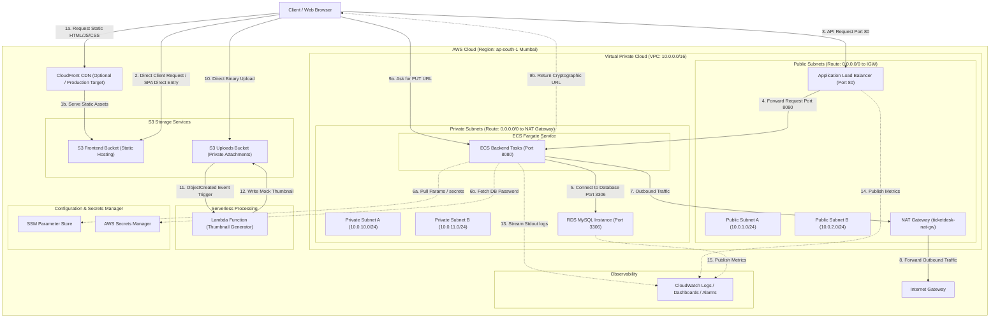

# TicketDesk End-to-End System Flow & Architecture

This document provides a deep, technical breakdown of the complete network, routing, security, compute, storage, and database flows for the TicketDesk application.

---

## 1. Architectural Diagram

Below is the complete network and data flow diagram showing how requests travel from the client browser through public routing boundaries, target groups, private security limits, and serverless events.



---

## 2. Networking Deep Dive & Subnet Layout

The deployment uses a dedicated Virtual Private Cloud (VPC) that isolates applications into segmented networking tiers across multiple Availability Zones (AZs) in `ap-south-1` (Mumbai).

* **VPC CIDR Block:** `10.0.0.0/16` (Provides 65,536 private IP addresses).
* **Public Subnets:**
  * **Public Subnet A (`10.0.1.0/24`)** in AZ `ap-south-1a`.
  * **Public Subnet B (`10.0.2.0/24`)** in AZ `ap-south-1b`.
  * *Characteristics:* These subnets have public IPv4 mapping enabled on launch (`map_public_ip_on_launch = true`). They hold internet-facing resources like the Application Load Balancer and the NAT Gateway.
* **Private Subnets:**
  * **Private Subnet A (`10.0.10.0/24`)** in AZ `ap-south-1a`.
  * **Private Subnet B (`10.0.11.0/24`)** in AZ `ap-south-1b`.
  * *Characteristics:* No public IPs are assigned here. Direct ingress from the public internet is impossible. This is where backend container tasks and RDS database instances run.

---

## 3. Routes, Gateways & Route Tables

Traffic within the VPC is routed using specialized route tables and gateways.

### Internet Gateway (IGW)
* **Resource:** `ticketdesk-igw`
* **Purpose:** Serves as the gateway for public internet ingress/egress. It is attached directly to the VPC.

### Elastic IP & NAT Gateway
* **Resource:** `ticketdesk-nat-gw` (placed in `Public Subnet A`) with Elastic IP `ticketdesk-nat-eip`.
* **Purpose:** Enables resources in private subnets (like ECS Fargate tasks) to make outbound connections to the internet (to pull Docker images, fetch configuration variables, download system packages) while preventing the internet from establishing inbound connections.

### Route Tables

1. **Public Route Table (`ticketdesk-route-table-public`):**
   * Associated with: `Public Subnet A` & `Public Subnet B`.
   * Routes:
     * `10.0.0.0/16` -> `local` (VPC-internal communication).
     * `0.0.0.0/0` -> `ticketdesk-igw` (Sends all outbound/internet traffic through the Internet Gateway).

2. **Private Route Table (`ticketdesk-route-table-private`):**
   * Associated with: `Private Subnet A` & `Private Subnet B`.
   * Routes:
     * `10.0.0.0/16` -> `local`.
     * `0.0.0.0/0` -> `ticketdesk-nat-gw` (Sends all outbound/internet traffic through the NAT Gateway located in the public subnet).

---

## 4. Entry Point & Edge Routing (S3 Frontend, CloudFront & ALB)

### Static Frontend Assets Flow
1. **Direct S3 Website Hosting:** In the POC environment, static React assets (HTML, CSS, JS) are stored in `ticketdesk-frontend-[suffix]` and served via S3 static website hosting. 
2. **CloudFront CDN:** In production, CloudFront CDN acts as the global caching proxy. 
   * **Cache Behavior (`/*`):** Intercepts requests for static files. Serves them from edge locations. If missed, pulls from S3 frontend bucket and caches.
   * **API Behavior (`/api/*` and `/health`):** Bypasses cache completely and routes traffic directly to the Application Load Balancer (ALB).

### Dynamic API Routing Flow
1. **User Request:** The client makes API requests on HTTP port `80` targeting the ALB DNS name.
2. **Application Load Balancer (ALB):**
   * Resides in Public Subnets `A` and `B` with public IPs.
   * Runs an HTTP Listener on Port `80` forwarding to Target Group `ticketdesk-m1-tg` on Port `8080`.
   * **Target Group Health Check:** ALB queries the `/health` endpoint on private target instances every 30 seconds. Targets must respond with HTTP `200` within 5 seconds. If a target fails 2 consecutive checks, it is flagged unhealthy and traffic stops routing to it.

---

## 5. Security Groups & Port Mappings

Network interfaces are guarded by stateful firewalls (Security Groups) adhering to the rule of least privilege.

| Security Group | Purpose | Inbound Rules | Outbound Rules |
| :--- | :--- | :--- | :--- |
| **`ticketdesk-m1-alb-sg`** | Protects the Load Balancer | Port `80` (HTTP) from `0.0.0.0/0` | All traffic (`0.0.0.0/0`) |
| **`ticketdesk-m1-task-sg`** | Protects ECS Fargate tasks | Port `8080` (TCP) strictly from `ticketdesk-m1-alb-sg` | All traffic (`0.0.0.0/0`) |
| **`ticketdesk-db-sg`** | Protects RDS database instance | Port `3306` (MySQL) strictly from `ticketdesk-m1-task-sg` | All traffic (`0.0.0.0/0`) |

* **Port 80 (HTTP):** Public access endpoint for the load balancer.
* **Port 8080 (TCP):** Internal port of the Spring Boot container. It is completely isolated and only reachable from the ALB security group.
* **Port 3306 (TCP):** Database listener port. Only reachable from ECS containers.

---

## 6. Compute Deep Dive (ECS, ECR, Services & Tasks)

The application code is packaged, stored, and executed using Amazon's serverless container infrastructure.

### Amazon ECR (Elastic Container Registry)
* **Resource:** `ticketdesk-backend` ECR repository.
* **Function:** Stores compiled Docker images. During CI/CD (GitHub Actions), the Spring Boot jar is compiled, wrapped in an Alpine-Java base image, and pushed here.

### ECS Cluster
* **Resource:** `ticketdesk-m1-cluster`
* **Function:** A logical namespace that groups services and tasks together inside the VPC.

### Task Definition
* **Resource:** `ticketdesk-m1-backend-task`
* **Key Configuration Details:**
  * **Network Mode:** `awsvpc` (Allocates a dedicated elastic network interface (ENI) and private IP to each container task).
  * **Compute Resources:** `256` CPU units (0.25 vCPU) and `512` MB Memory.
  * **Launch Type Compatibility:** `FARGATE` (Serverless compute execution, managed by AWS).
  * **Container Mapping:** Image URI pulled from ECR, exposing container port `8080`.
  * **Logging:** `awslogs` driver redirects all stdout/stderr streams to AWS CloudWatch Log Group `/ecs/ticketdesk-m1-backend`.

### IAM Roles & Execution Boundaries
1. **ECS Task Execution Role (`ticketdesk-m1-execution-role`):**
   * **Assumed By:** The ECS container agent *before* the application starts.
   * **Permissions:**
     * `ecr:GetAuthorizationToken`, `ecr:BatchCheckLayerAvailability`, `ecr:GetDownloadUrlForLayer` (To pull images from ECR).
     * `logs:CreateLogStream`, `logs:PutLogEvents` (To create log streams in CloudWatch).
     * `ssm:GetParameter`, `secretsmanager:GetSecretValue` (To fetch setup parameters and database password).
2. **ECS Task Role (`ticketdesk-m1-task-role`):**
   * **Assumed By:** The running Spring Boot application *during* runtime execution.
   * **Permissions:**
     * `s3:PutObject`, `s3:GetObject`, `s3:DeleteObject`, `s3:ListBucket` (Required by Java S3 SDK to generate S3 presigned URLs for attachments).

### ECS Service
* **Resource:** `ticketdesk-m1-service`
* **Function:** The coordinator that maintains target scale (desired count: `1`). It runs tasks inside Private Subnets `A` and `B` with the container task security group and hooks them into the ALB target group.

---

## 7. Configuration & Secrets Resolution Flow

To keep passwords out of source repositories, database coordinates and credentials are resolved dynamically when container tasks boot up:

```
[ ECS Fargate Container Booting ]
              │
              ├──> 1. Read Task Definition Environment/Secrets mappings
              │
              ├──> 2. Query SSM Parameter Store (using Task Execution Role):
              │       • Read "/ticketdesk/db_url"
              │       • Read "/ticketdesk/db_user"
              │       • Read "/ticketdesk/s3_bucket"
              │       • Read "/ticketdesk/s3_region"
              │
              ├──> 3. Query AWS Secrets Manager:
              │       • Read "ticketdesk-db-password"
              │
              └──> 4. Inject resolved values as Environment Variables:
                      • SPRING_PROFILES_ACTIVE = mysql
                      • DB_URL = jdbc:mysql://[rds-endpoint]:3306/ticketdb
                      • DB_USER = admin
                      • DB_PASSWORD = [decrypted-password]
                      • AWS_S3_BUCKET = [bucket-id]
                      • AWS_S3_REGION = ap-south-1
```

Once environment variables are mapped, the JVM starts, compiles the Hikari database connection pool, and registers controllers on port `8080`.

---

## 8. Relational Database Tier

* **Resource:** `ticketdesk-db` (Amazon RDS MySQL 8.0 instance).
* **Storage Capacity:** 20 GB allocated (autoscaling up to 100 GB).
* **Subnets:** Bound to `ticketdesk-db-subnet-group` containing private subnets `private_a` and `private_b`.
* **Access Control:** `publicly_accessible = false` ensures no external hostname is registered. Database connection credentials (generated randomly via Terraform `random_password`) are accessed only by the ECS tasks using `ticketdesk-db-sg` port `3306`.

---

## 9. Attachment Upload & S3 Presigned URL Flow

Uploading files via application servers consumes precious container memory and bandwidth. TicketDesk eliminates this using an S3 Presigned URL upload flow:

```
Client Browser             Spring Boot App             Amazon S3 Uploads
      │                           │                            │
      │ 1. GET /api/attachments/  │                            │
      │    presigned-put?key=f.jpg│                            │
      ├──────────────────────────>│                            │
      │                           │ 2. Generate Presigned URL  │
      │                           │    (using Task Role)       │
      │ <─────────────────────────┤                            │
      │    Presigned URL returned │                            │
      │                           │                            │
      │ 3. HTTP PUT Binary payload directly to S3 URL           │
      ├───────────────────────────────────────────────────────>│
      │                                                        │ 4. S3 fires trigger
      │                                                        │    (ObjectCreated)
```

1. **Request URL:** Client clicks "Upload Attachment". The browser requests a PUT URL from the backend controller.
2. **Cryptography Signature:** The backend application uses the AWS SDK to sign an ephemeral upload link valid for 15 minutes.
3. **Direct Upload:** The client performs an HTTP `PUT` request directly to S3.
4. **CORS Validation:** S3 verifies CORS rules to permit direct browser headers (`PUT`, `GET`, `POST`, `HEAD`) from any origin.

---

## 10. Asynchronous Serverless Thumbnail Generation

Once an image hits the uploads bucket, a serverless lambda function handles thumbnail scaling in the background:

1. **S3 Notification Event:** S3 triggers `ticketdesk-thumbnail-generator` Lambda upon receiving `s3:ObjectCreated:*` events.
2. **Lambda IAM Auth:** The function assumes the `ticketdesk-lambda-role` granting:
   * Write logs to CloudWatch.
   * `s3:GetObject` and `s3:PutObject` permissions on the uploads bucket.
3. **Execution Script:**
   * Lambda parses the S3 event to read the object key.
   * If the key begins with `thumbnails/`, it exits to prevent infinite trigger loops.
   * Otherwise, it processes the image, writes a mock text thumbnail prefix back to `thumbnails/filename.ext`, and exits.
4. **Secure Download:** When displaying tickets, the React client requests a presigned GET URL from the backend controller (`/api/attachments/presigned-thumbnail?key=filename.ext`), providing secure read access.

---

## 11. Parameters, Secrets, and Access Tokens Lifecycle

This section details how configurations, credentials, and cryptographic tokens are generated, authorized, and rotated across the system.

### A. AWS Systems Manager (SSM) Parameters & Secrets Manager
* **Parameter Store (SSM):** Stores non-sensitive variables.
  * `/ticketdesk/db_url`: Mapped to database endpoint JDBC URL.
  * `/ticketdesk/db_user`: Database username (`admin`).
  * `/ticketdesk/s3_bucket`: Upload S3 bucket name.
  * `/ticketdesk/s3_region`: Target region (`ap-south-1`).
* **Secrets Manager:** Stores sensitive credentials.
  * `ticketdesk-db-password`: Automatically generated 16-character alphanumeric string.
* **Access Control:** The ECS Task Execution Role (`ticketdesk-m1-execution-role`) has a policy explicitly granting read permissions (`ssm:GetParameter*` and `secretsmanager:GetSecretValue`) on these specific resource ARNs.
* **Startup Injection:** The ECS Fargate agent calls these APIs at container startup, decrypts the Secrets Manager payload, and mounts the values as environment variables inside the Java Spring Boot container runtime context.

### B. AWS Security Token Service (STS) & Temporary Credentials
* **Instance/Task IAM Authorization:** The application never stores hardcoded AWS Access Keys (`AWS_ACCESS_KEY_ID` or `AWS_SECRET_ACCESS_KEY`) in the code or container image.
* **Task Role Runtime Auth:**
  * When a container task boots, ECS allocates a local metadata endpoint URL to the task (`$AWS_CONTAINER_CREDENTIALS_RELATIVE_URI`).
  * The Spring Boot AWS SDK reads this environment variable and queries the AWS ECS agent.
  * The ECS agent returns temporary access credentials (an Access Key, Secret Key, and a temporary **Session Token** generated by **AWS STS**) linked to the Task Role (`ticketdesk-m1-task-role`).
  * These credentials automatically rotate every few hours without application downtime.
* **Lambda Execution Auth:** The Lambda function operates similarly, automatically receiving short-lived STS credentials bound to `ticketdesk-lambda-role` on execution.

### C. Amazon ECR Registry Authentication Tokens
* **The Access Protocol:** Amazon ECR requires registry authentication before any client or service can pull or push images.
* **The Auth Token:** 
  * The developer or GitHub Actions runner runs `aws ecr get-login-password`.
  * AWS returns an encrypted authentication token.
  * This token is passed via a standard Docker login command.
  * **Token Lifespan:** These registry authentication tokens are strictly valid for **12 hours**. Once expired, the docker client must request a new token via STS/ECR APIs.
* **Fargate Image Pulls:** Fargate container agents automatically manage ECR token generation and renewal behind the scenes using the ECS Task Execution Role permissions.

### D. S3 Presigned URL Signature Parameters
* **Purpose:** Allows untrusted client web browsers to perform PUT uploads and GET downloads directly from the private uploads S3 bucket without exposing AWS credentials.
* **Signature Generation:**
  * The backend (`AttachmentController.java`) calls the AWS S3 SDK helper.
  * The SDK uses the temporary Task Role credentials (Access Key, Secret Key, Session Token) to generate a signed URL using **AWS Signature Version 4 (SigV4)**.
* **Token Query Parameters:** The resulting URL contains cryptographic identity markers in the query string:
  * `X-Amz-Algorithm`: The signing algorithm (typically `AWS4-HMAC-SHA256`).
  * `X-Amz-Credential`: The access key scope including date, region, and target service.
  * `X-Amz-Date`: The exact ISO 8601 timestamp when the signature was created.
  * `X-Amz-Expires`: The expiration window in seconds (configured for 15 minutes / `900` seconds).
  * `X-Amz-Security-Token`: The temporary session token generated by AWS STS.
  * `X-Amz-SignedHeaders`: The headers that must be matched exactly during upload.
  * `X-Amz-Signature`: The hex-encoded HMAC-SHA256 signature validating the authenticity of the URL request.
* **Verification:** S3 decrypts and verifies this signature at upload time. If the URL has expired or query parameters are modified, the request is rejected with HTTP `403 Forbidden`.

### E. CI/CD Pipeline Deployment Authentication (GitHub Actions & OIDC)
* **Secure Federation:** To prevent storing permanent AWS Access Keys as GitHub repository secrets, the CI/CD pipeline (`ci.yml`) uses OpenID Connect (OIDC).
* **The Token Exchange:**
  1. The GitHub Actions runner requests a JSON Web Token (JWT) from GitHub's OIDC provider.
  2. The runner requests AWS STS to assume the configured IAM role using the command `aws-actions/configure-aws-credentials`.
  3. AWS STS validates the GitHub JWT against the trust configuration set on the AWS IAM Identity Provider.
  4. STS returns temporary, short-lived AWS session credentials (Access Key, Secret Key, and Session Token) to the runner.
  5. The runner uses these credentials to log into ECR, push the Docker image, and update the ECS task definition and service.

---

## 12. Monitoring, Metrics & Observability

Observability is maintained through Amazon CloudWatch.

### CloudWatch Dashboard (`ticketdesk-m1-dashboard`)
Aggregates performance metrics:
1. **ALB request counts:** Monitors traffic volume (`RequestCount`).
2. **Target error tracking:** Graphs `HTTPCode_Target_5XX_Count` (server failures) and `HTTPCode_Target_4XX_Count` (client routing errors).
3. **Target Latency:** Plots `TargetResponseTime` (Average, p90, and p99 metrics) to locate bottleneck API paths.
4. **ECS Task Resources:** Displays CPU and Memory utilization.
5. **Database connections:** Monitors RDS pool metrics (`DatabaseConnections`).

### Alarms & Threshold Actions
Alarms alert administrators if thresholds are breached:
* **`ticketdesk-m1-alb-high-5xx`:** Alarms if the ALB target group returns 5 or more HTTP 5XX server responses inside a 60-second window.
* **`ticketdesk-m1-unhealthy-targets`:** Alarms if `UnhealthyHostCount` is equal to or greater than `1` target host.
* **`ticketdesk-m1-rds-high-cpu`:** Alarms if RDS instance CPU utilization exceeds 80% for two consecutive 5-minute evaluation periods.
